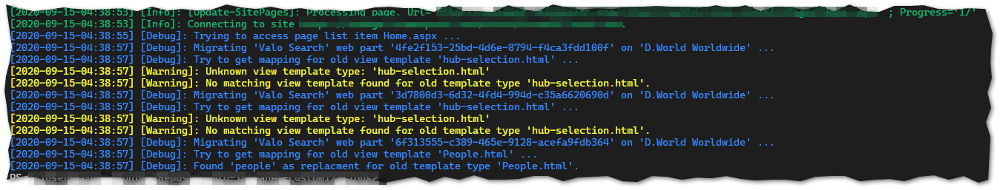
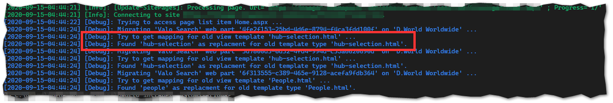
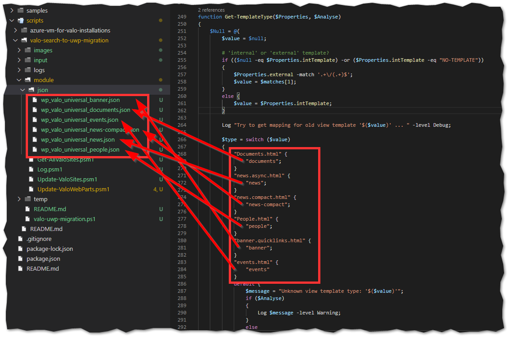
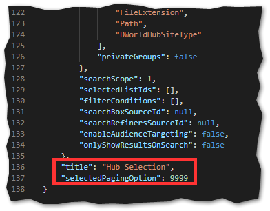
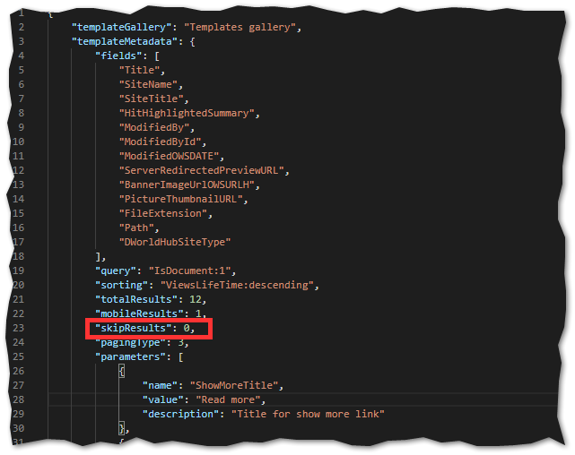

# Valo Universal web part migration

A solution to automate the migration from "Valo Search" web part to the "Valo Universal" web part.

## Summary

This solution has been developed to ease the pain of migrating the "Valo Search" web part on hundreds of pages in each and every Valo intallation at your customer's tenants.

The idea behind the solution was to automate the migration process as far as possible. As both web parts have lots of parameters the overall task has some complexity. This said - don't expect this solution to be an out-of-the-box setup for all your migration tasks!

Please read the "Migration Procedure" below for more details on the overall process.

This solution is developed using the following technologies:

* PowerShell 5.1
* SharePointPnPPowerShellOnline 3.25.2009.1 ([PnP PowerShell](https://docs.microsoft.com/en-us/powershell/sharepoint/sharepoint-pnp/sharepoint-pnp-cmdlets))
* [VS Code](https://code.visualstudio.com/) (recommended for configuration and run/debug)

## Used Valo Version

* Tested with Valo Modern 1.6 and 1.7

## Prerequisites

It is required that the users have PowerShell 5.1 on Windows. As the solution makes full use of PnP library PowerShell Core is not sufficient.

[PnP PowerShell](https://docs.microsoft.com/en-us/powershell/sharepoint/sharepoint-pnp/sharepoint-pnp-cmdlets) must be installed on the client. We usually are working with the latest release as stated above, but feel free to test another one ...

## Migration Procedure

### General Approach

The general approach of migrating the Valo Search web part to the Valo Universal web part is to just transfer all relevant configuration parameters from the one to the other. This of course is not so easy done, as both web parts have lots of parameters and slightly differ in the overall configuration structure.

Another point to keep in mind is the fact that the actual configuration of web part instance in both case differ based on the Handlebar templates in use. Thus said - a simple one-to-one mapping of the web part instance's JSON configuration won't be possible or at least it would be far too complex.

This leads us to the current approach: We basically need a mapping for each individual Handlebar configuration in use. The source structure of course is already in place in the pages you want to migrate. What needs to be done is to create a sample target structure for each Handlebar setup.

As said before - we are talking about a sample or better "stub" configuration here. The actual Valo Search web part configuration for each web part instance still needs to be applied on top of that. Just think about search query or paging settings for example.

Luckily we can limit this additional mapping effort mainly to some generic settings. All the rest is already in place thanks to our configuration stub JSON. Search query, paging, page size, skip items, sorting etc. will be applied to the new Valo Universal web part based on the individual configuration of the Valo Search web part you're migrating. This is even true for the template configuration parameters. All this steps will be handled automatically by the solution.

The effort you still need to invest before running the script on a specific tenant really depends on the amount and type of Handlebar templates you've currently in use. We've already prepared most of the Valo standard templates (at least the ones we use at the moment). These templates are included here - feel free to add more! Of course we had a couple more templates, but those are plain customer specific and thus not included here.

### Required Steps

Before you can actually think about using one of the above methods you should check that you've all your preparations in place. So - what needs to be done first?

1. Try to find out which handlebar templates are in use in your pages! For each handlebar template in use we will need a matching JSON template as configuration "stub". How you get that I will tell you in a minute ...
1. For Valo standard handlebars I've already included some required templates (but not all). If you need more, you'll have to generate them. The same is true of course for further custom templates you might have in use.
1. You're unsure which kind of templates are in use? You're lucky - this solution will help you find out. Just start it in one of the above operation modes with the flag *-Analyze* set. Plese see the section "Commands" below for more details. Running the analysis will give you warning outputs for all handlebar templates the solution currently cannot match. These are the templates you'll have to focus on.

1. Thanks to the analyisis mode of the solution you've now identified the template configuration stubs you need to add. A detailed description how to do that you'll find below in the section "Extending the template mapping".
1. Ok - fine. Now you now, what needs to be mapped, but how to get that JSON template? That's actually easy - all you need is a Valo Universal webpart on a site page running the desired target handlebar template. You can easily export the JSON from there - it's exactly the PropertyJson Data of the web part. For more details on this process please see the section "Exporting a configuration stub" below.
1. Oops, you don't have a handlebar that's Valo Universal web part compatible? Yes, that's some point. There is some template migration work to be done first, if you're using custom templates. Further details on that might be found in Valo documentation.
1. Once you've done the above steps you might want to repeat the analysis done before. It should now look like this:

If that's the case, you're ready to roll. If not make sure to map all templates that still produce a waring first.

### Extending the template mapping

To extend the solution's template mapping you will have to add some code in the file [UpdateValoWebParts.psm1](./module/Update-ValoWebParts.psm1). The mappings in the following screenshot correlate with the JSON template stubs included [here](./module/json). New handlebar templates have to be added in the PowerShell file and the JSON file has to be added to the JSON folder. Please have a look at the naming-convention used here.



Extending the code to add another template mapping will look like this:

  

Staying in this scenario - to add the corresponding JSON file you'll have to add a JSON named *wp_valo_universal_hub-selection.json* to the [folder](./module/json).

Ok, fine - but what needs to be set within our new mapping file? More details on this in the next section "Exporting a configuration stub".

### Exporting a configuration stub

You nee a JSON configuration stub for a Handlebar template not previously mapped? Here is how you get it. Just open a PowerShell window and type the following commands (without comments, of course ...):

```powershell

# Connect to site
Connect-PnPOnline https://mytenant.sharepoint.com/sites/sample-site

# Get page
$page = Get-PnPClientSidePage -Identity sample-page.aspx

# Show page components
Get-PnPClientSideComponent -Page $page

# You will get output with all components on the page.
# Search for Title "Valo - Search" and copy the "IntanceId" value

# Get Valo Search web part
$wp = Get-PnPClientSideComponent -Page $page -InstanceId some-guid

# Display the JSON data
$wp.PropertiesJson

```

Copy the whole JSON from opening to closing curly bracket and paste it to the new JSON file. Make sure to respect the naming conventions mentioned above.

Tip: You can "pretty print" the JSON using e. g. VS Code to optimize readability.

### Troubeshooting

The nasty thing with the PropertyJson data used for our JSON template stubs is, that not all properties will get exported in every case. So we need to make sure everything is in place that we might need for customizing.

Here are some properties I've noticed we have to check for existence:

#### Title and Paging Options

If you don't set a title in the Valo Universal web part or don't play with the paging options these both properties at the end of the configuration might be missing. Please make sure to add them in that case. The actual values in the template don't really matter, as the will be overwritten in the actual mapping process:



### Skip Results Property

There are some more parameters in the "templateMetaData" section of the object structure that need you attention. Most of the stuff should be fine here, but make sure that the "skipResults" parameter is set as shown below. Here again - the actual value is not important.



### Backup

It is strongly recommended to use the -BackupOldPages flag to generate a backup file of each page before actually migrating it. Backup files will be generated in the [temp folder](./temp). The Script will create a folder for each hub (using the "HubPrefix" parameter) and a subfolder for the current site.

If someting went desperately wrong in your migration process you have now the option to iterate over the files here and apply the templates to get back to your old pages. This is a good approach to be scripted to repair lots of pages. If you're just handling individual pages the SharePoint version history of the page should be sufficient for restoring the old state.

## Commands

This script solution has three available commands. Which one is best suited for your scenario you'll have to find out yourself. However - for a starting point I would recommend to just choose a few dedicated pages of interest and define them in the [Excel sheet](./input/migrate-pages.xlsx). Then use the Excel-based, [page-wise migration option](./Update-ValoPages.md) to process these pages.

For further documentation on the individual commands, please see the following documentations:

* [Update-ValoPages](./Update-ValoPages.md): Migrate specific pages defined in an [Excel sheet](./input/migrate-pages.xlsx).
* [Update-ValoSites](./Update-ValoSites.md): Migrate all pages in a specific site.
* [Update-AllValo-Sites](./Update-AllValoSites.md): Migrate all pages in all sites of a Valo hub.

You'll find a [sample bootstrap script](./valo-uwp-migration.ps1) that incorporates sample code for the commands as a quick start.

## Setup

First you have to checkout the whole solution folder somewhere to your local harddisk. Now make sure that PnP PowerShell is installed on your machine.

For starting the solution, please customise and use the [sample bootstrap script](./valo-uwp-migration.ps1).

If you want to use an Excel sheet as input, you can use the [provided file](./input/migrate-pages.xlsx). Of course you'll have to add your own entries there. A sample entry is included to give you some clue of what is needed by our script.

## Solution

Solution|Author(s)
--------|---------
valo-search-to-uwp-migration | [Ole Rühaak](https://www.linkedin.com/in/ole-ruehaak/), [GIS AG](https://gis-ag.com)

## Version history

Version|Date|Comments
-------|----|--------
1.0 | September 16, 2020 | Initial Release

## Disclaimer

**THIS CODE IS PROVIDED *AS IS* WITHOUT WARRANTY OF ANY KIND, EITHER EXPRESS OR IMPLIED, INCLUDING ANY IMPLIED WARRANTIES OF FITNESS FOR A PARTICULAR PURPOSE, MERCHANTABILITY, OR NON-INFRINGEMENT.**
